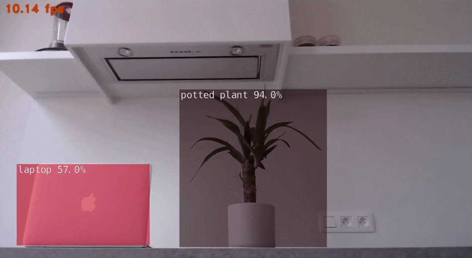
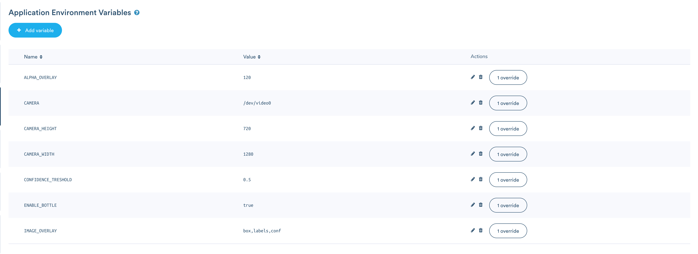

# Computer Vision with Jetson Nano - Object Detection
Object detection with SSD MobileNet v2 COCO model optimized with TensorRT on NVIDIA Jetson Nano built upon Jetson Inference of dusty-nv (https://github.com/dusty-nv/jetson-inference).

Feel free to read about this with some more details on [Medium](https://medium.com/technology-at-rombit/computer-vision-with-jetson-nano-bccf8e6c6256).

[](https://hub.docker.com/r/bouwe/computer-vision-jetson-nano)

All docker files rely on standard deb/zip/tbz2 files which include all necessary libraries like CUDA, CUDNN, TensorRT etc. It is possible to download these directly from the nvidia developer console. I'm using a Logitech C920 HD Pro webcam attached to my Jetson Nano for doing object detection with. I've used the Jetson Inference of dusty-nv (https://github.com/dusty-nv/jetson-inference) to make this work. The pretrained SSD MobileNet v2 COCO model optimized for TensorRT is used. It will automatically serve the images with Bottle (https://github.com/bottlepy/bottle) on port 80 of your Jetson Nano which can then be viewed by going to the ip of that device. Resolution of the webcam is set to 1024x720. I'd advise to look at NVIDIA DeepStream for more performant detection.

[](./images/detection.gif)

```bash
{'datetime': '2019-10-21 17:21:58.437843', 'objects': {0: {'width': 1162.0321044921875, 'height': 647.0380249023438, 'class': 'potted plant', 'confidence': 0.7641790533065796, 'center': (611.6964111328125, 379.59674072265625)}, 1: {'width': 1234.2661349701875, 'height': 829.8434554443438, 'class': 'vase', 'confidence': 0.7241782743065926, 'center': (608.7052469498425, 445.52664032255785)}}, 'objects_count': '2'}
```

## Run with Docker
There's a docker image of this application which can be run on your Jetson Nano device. This image has all of the Jetpack components already installed so it will work without NVIDIA JETPACK flashed onto your sd-card, this will come in handy when you would want to deploy this with Balena, as explained later. The object recognition will be available in your browser.

```bash
docker run --privileged -it bouwe/computer-vision-jetson-nano:latest
```

It is possible to run jtop (https://github.com/rbonghi/jetson_stats) in the container if you change the entrypoint to systemd. Note that this overrides the entrypoint and the application will have to be manually started.

```bash
docker run --privileged --entrypoint /bin/systemd -it bouwe/jetson-nano-vision:latest
```

Now go to the IP of your Jetson Nano or go to `127.0.0.1` if you are currently on your device.

```bash
http://<ip_jetson_nano>:80
```

## Environment variables
It is possible to set environment variables within your Docker environment.

* IMAGE_OVERLAY (the detection annotation, default 'box,labels,conf')
* CAMERA_HEIGHT (width of camera footage, default 720)
* CAMERA_WIDTH (width of camera footage, default 1280)
* CAMERA (which camera source to use, default '/dev/video0')
* CONFIDENCE_TRESHOLD (confidence of detection, default 0.5)
* ALPHA_OVERLAY (alpha value of the image overlay of the detection, default 120)
* ENABLE_BOTTLE (enable Bottlepy webserver, default true)
* ENABLE_LOGGING (enable logging, default false)

## Deploy with Balena
Clone this repository, ceate an application on Balena Cloud (https://www.balena.io/cloud/) and flash Balena OS on an sd-card and put it in the Jetson Nano. It's now possible to link a git repository with Balena. Balena will use the docker-compose.yml file in the root of the directory to build and deploy the container.

```bash
git remote add balena <user>@git.balena-cloud.com:<user>/<application>.git
```
and execute a git push if the remote is called 'balena'.
```bash
git push balena master
```

It is possible to set aforementioned environment variables, you can also do this with Balena as shown below.

[](./images/balena.png)

Now go to the ip of your Jetson Nano. This ip will be visible in the Balena Cloud UI.

## Building the images yourself
To proceed, login to the developer zone https://developer.nvidia.com/. Download following files, these are the dependencies and base files for NVIDIA JETPACK 4.2.2 and place them in the 'debs' folder.
* https://developer.download.nvidia.com/devzone/devcenter/mobile/jetpack_l4t/JETPACK_422_b21/P3448-0000/Jetson-210_Linux_R32.2.1_aarch64.tbz2
* https://developer.download.nvidia.com/devzone/devcenter/mobile/jetpack_l4t/JETPACK_422_b21/cuda-repo-l4t-10-0-local-10.0.326_1.0-1_arm64.deb
* https://developer.download.nvidia.com/devzone/devcenter/mobile/jetpack_l4t/JETPACK_422_b21/P3448-0000/libcudnn7_7.5.0.56-1+cuda10.0_arm64.deb
* https://developer.download.nvidia.com/devzone/devcenter/mobile/jetpack_l4t/JETPACK_422_b21/P3448-0000/libcudnn7-dev_7.5.0.56-1+cuda10.0_arm64.deb
* https://developer.download.nvidia.com/devzone/devcenter/mobile/jetpack_l4t/JETPACK_422_b21/P3448-0000/libcudnn7-doc_7.5.0.56-1+cuda10.0_arm64.deb
* https://developer.download.nvidia.com/devzone/devcenter/mobile/jetpack_l4t/JETPACK_422_b21/P3448-0000/libnvinfer5_5.1.6-1+cuda10.0_arm64.deb
* https://developer.download.nvidia.com/devzone/devcenter/mobile/jetpack_l4t/JETPACK_422_b21/P3448-0000/libnvinfer-dev_5.1.6-1+cuda10.0_arm64.deb
* https://developer.download.nvidia.com/devzone/devcenter/mobile/jetpack_l4t/JETPACK_422_b21/P3448-0000/libnvinfer-samples_5.1.6-1+cuda10.0_all.deb
* https://developer.download.nvidia.com/devzone/devcenter/mobile/jetpack_l4t/JETPACK_422_b21/P3448-0000/tensorrt_5.1.6.1-1+cuda10.0_arm64.deb
* https://developer.download.nvidia.com/devzone/devcenter/mobile/jetpack_l4t/JETPACK_422_b21/P3448-0000/python-libnvinfer_5.1.6-1+cuda10.0_arm64.deb
* https://developer.download.nvidia.com/devzone/devcenter/mobile/jetpack_l4t/JETPACK_422_b21/P3448-0000/python-libnvinfer-dev_5.1.6-1+cuda10.0_arm64.deb
* https://developer.download.nvidia.com/devzone/devcenter/mobile/jetpack_l4t/JETPACK_422_b21/P3448-0000/python3-libnvinfer_5.1.6-1+cuda10.0_arm64.deb
* https://developer.download.nvidia.com/devzone/devcenter/mobile/jetpack_l4t/JETPACK_422_b21/P3448-0000/python3-libnvinfer-dev_5.1.6-1+cuda10.0_arm64.deb
* https://developer.download.nvidia.com/devzone/devcenter/mobile/jetpack_l4t/JETPACK_422_b21/P3448-0000/graphsurgeon-tf_5.1.6-1+cuda10.0_arm64.deb
* https://developer.download.nvidia.com/devzone/devcenter/mobile/jetpack_l4t/JETPACK_422_b21/P3448-0000/uff-converter-tf_5.1.6-1+cuda10.0_arm64.deb

Run move_deb.sh to put all files in the right folders in order for Docker containers to be built.

```bash
sh move_debs.sh
```
